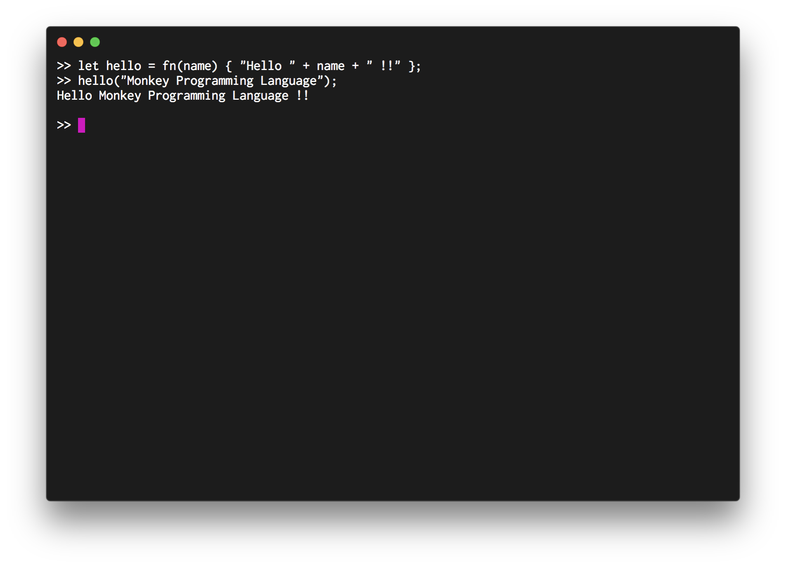
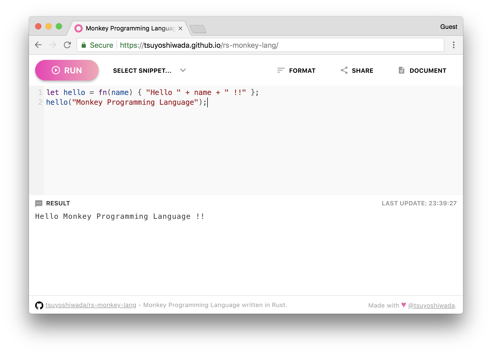

# rs-monkey-lang

[](https://circleci.com/gh/wadackel/rs-monkey-lang)

> Monkey Programming Language written in Rust.


## What's Monkey?


> The official Monkey logo

`Monkey` is a programming language designed to learn interpreters.  
It's came from [Writing An Interpreter In Go][writing-an-interpreter-in-go].


## Try Monkey!

### with REPL



```bash
$ git clone https://github.com/wadackel/rs-monkey-lang.git
$ make repl
```

### with Online Playground



Working with Wasm!! Awesome :dog:  
https://wadackel.github.io/rs-monkey-lang/


## Documentation

I created the document with reference to [Writing An Interpreter In Go][writing-an-interpreter-in-go].  

:warning: **Please note that there may be some mistakes.**

### Table of Contents

- [Summary](#summary)
- [Syntax overview](#syntax-overview)
    - [If](#if)
    - [Operators](#operators)
    - [Return](#return)
- [Variable bindings](#variable-bindings)
- [Literals](#literals)
    - [Integer](#integer)
    - [Boolean](#boolean)
    - [String](#string)
    - [Array](#array)
    - [Hashes](#hashes)
    - [Function](#function)
- [Built-in Functions](#built-in-functions)
    - [`puts(<arg1>, <arg2>, ...): void`](#putsarg1-arg2--void)
    - [`len(<arg>): Intger`](#lenarg-intger)
    - [`first(<arg>): any`](#firstarg-any)
    - [`last(<arg>): any`](#lastarg-any)
    - [`rest(<arg>): Array`](#restarg-array)
    - [`push(<arg1>, <arg2>): Array`](#pusharg1-arg2-array)

### Summary

- C-like syntax
- variable bindings
- integers and booleans
- a string data structure
- an array data structure
- a hash data structure
- arithmetic expressions
- built-in functions
- first-class and higher-order functions • closures

### Syntax overview

An example of Fibonacci function.

```
let fibonacci = fn(x) {
  if (x == 0) {
    0;
  } else {
    if (x == 1) {
      1;
    } else {
      fibonacci(x - 1) + fibonacci(x - 2);
    }
  }
};

fibonacci(10);
```

#### If

It supports the general `if`. `else` exists, but` else if` does not exist.

```
if (true) {
  10;
} else {
  5;
}
```

#### Operators

It supports the general operations.

```
1 + 2 + (3 * 4) - (10 / 5);
!true;
!false;
+10;
-5;
"Hello" + " " + "World";
```

#### Return

It returns the value immediately. No further processing will be executed.

```
if (true) {
  return;
}
```

```
let identity = fn(x) {
  return x;
};

identity("Monkey");
```

### Variable bindings

Variable bindings, such as those supported by many programming languages, are implemented. Variables can be defined using the `let` keyword.

**Format:**

```
let <identifier> = <expression>;
```

**Example:**

```
let x = 0;
let y = 10;
let foobar = add(5, 5);
let alias = foobar;
let identity = fn(x) { x };
```

### Literals

Five types of literals are implemented.

#### Integer

`Integer` represents an integer value. Floating point numbers can not be handled.

**Format:**

```
[-+]?[1-9][0-9]*;
```

**Example:**

```
10;
1234;
```

#### Boolean

`Boolean` represents a general boolean types.

**Format:**

```
true | false;
```

**Example:**

```
true;
false;

let truthy = !false;
let falsy = !true;
```

#### String

`String` represents a string. Only double quotes can be used.

**Format:**

```
"<value>";
```

**Example:**

```
"Monkey Programming Language";
"Hello" + " " + "World";
```

#### Array

`Array` represents an ordered contiguous element. Each element can contain different data types.

**Format:**

```
[<expression>, <expression>, ...];
```

**Example:**

```
[1, 2, 3 + 3, fn(x) { x }, add(2, 2), true];
```

```
let arr = [1, true, fn(x) { x }];

arr[0];
arr[1];
arr[2](10);
arr[1 + 1](10);
```

#### Hashes

`Hash` expresses data associating keys with values.

**Format:**

```
{ <expression>: <expression>, <expression>: <expression>, ... };
```

**Example:**

```
let hash = {
  "name": "Jimmy",
  "age": 72,
  true: "a boolean",
  99: "an integer"
};

hash["name"];
hash["a" + "ge"];
hash[true];
hash[99];
hash[100 - 1];
```

#### Function

`Function` supports functions like those supported by other programming languages.

**Format:**

```
fn (<parameter one>, <parameter two>, ...) { <block statement> };
```

**Example:**

```
let add = fn(x, y) {
  return x + y;
};

add(10, 20);
```

```
let add = fn(x, y) {
  x + y;
};

add(10, 20);
```

If `return` does not exist, it returns the result of the last evaluated expression.

```
let addThree = fn(x) { x + 3 };
let callTwoTimes = fn(x, f) { f(f(x)) };

callTwoTimes(3, addThree);
```

Passing around functions, higher-order functions and closures will also work.

### Built-in Functions

You can use 6 built-in functions :rocket:

#### `puts(<arg1>, <arg2>, ...): void`

It outputs the specified value to `stdout`. In the case of Playground, it is output to `console`.

```
puts("Hello");
puts("World!");
```

#### `len(<arg>): Intger`

For `String`, it returns the number of characters. If it's `Array`, it returns the number of elements.

```
len("Monkey");
len([0, 1, 2]);
```

#### `first(<arg>): any`

Returns the element at the beginning of `Array`.

```
first([0, 1, 2]);
```

#### `last(<arg>): any`

Returns the element at the last of `Array`.

```
last([0, 1, 2]);
```

#### `rest(<arg>): Array`

Returns a new `Array` with the first element removed.

```
rest([0, 1, 2]);
```

#### `push(<arg1>, <arg2>): Array`

Returns a new `Array` with the element specified at the end added.

```
push([0, 1], 2);
```


---

Enjoy Monkey :monkey_face: !

---


## License

[MIT © wadackel](./LICENSE)


[writing-an-interpreter-in-go]: https://interpreterbook.com/#the-monkey-programming-language
